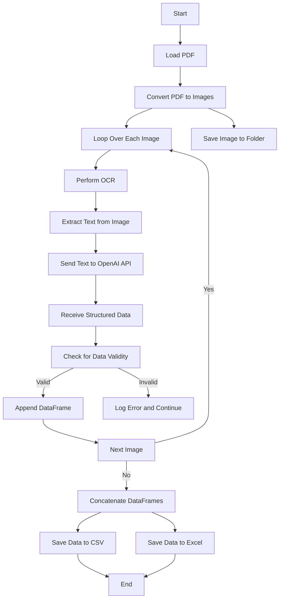

# PDF to Excel/CSV Table Extraction

This repository provides a Python script for converting PDF documents containing tabular data into structured CSV and Excel files. The script uses OCR to extract text from PDF pages, processes the extracted text with OpenAI's GPT-4 model to accurately parse tables, and saves the data in multiple formats.

## Table of Contents

- [Features](#features)
- [Requirements](#requirements)
- [Installation](#installation)
- [Usage](#usage)
- [Implementation Details](#implementation-details)
- [Diagram of Code Flow](#diagram-of-code-flow)
- [Output](#output)
- [Contributing](#contributing)
- [License](#license)

## Features

- **PDF to Image Conversion**: Converts each page of a PDF into an image for better text extraction.
- **OCR Text Extraction**: Uses Tesseract OCR to extract text from each image.
- **AI-Assisted Table Parsing**: Leverages OpenAI's GPT-4 model to accurately interpret and structure tabular data.
- **Data Export**: Saves extracted tables to CSV and Excel formats.
- **Image Storage**: Saves each PDF page as an image for verification or further processing.

## Requirements

Ensure you have the following prerequisites:

- Python 3.7+
- Tesseract OCR
- OpenAI API Key with access to GPT-4
- Required Python packages: `pdf2image`, `pytesseract`, `pandas`, `openai`, `dotenv`, `Pillow`

## Installation

### Step 1: Clone the Repository

Clone the repository to your local machine:

```bash
git clone https://github.com/Ismat-Samadov/pdf_to_excel.git
cd pdf_to_excel
```

### Step 2: Install Dependencies

Create a virtual environment and install the required packages:

```bash
python3 -m venv venv
source venv/bin/activate  # On macOS/Linux
# venv\Scripts\activate  # On Windows

pip install -r requirements.txt
```

### Step 3: Install Tesseract OCR

Install Tesseract OCR to enable text extraction from images:

#### On Ubuntu

```bash
sudo apt-get update
sudo apt-get install tesseract-ocr
```

#### On macOS

```bash
brew install tesseract
```

#### On Windows

Download and install Tesseract from [Tesseract OCR](https://github.com/tesseract-ocr/tesseract/wiki).

### Step 4: Configure OpenAI API Key

Create a `.env` file in the root directory and add your OpenAI API key:

```plaintext
OPENAI_API_KEY=your_openai_api_key_here
```

## Usage

1. **Place your PDF file** in the root directory and rename it to `file.pdf`.

2. **Run the script**:

   ```bash
   python convert.py
   ```

3. **Check the output files** in the root directory for CSV, Excel, and image files.

## Implementation Details

### PDF to Image Conversion

The script uses `pdf2image` to convert each page of the PDF into an image, which allows for more accurate OCR processing.

### OCR Text Extraction

Tesseract OCR extracts text from each image. This text is then sent to OpenAI's GPT-4 model for interpretation.

### AI-Assisted Table Parsing

OpenAI's GPT-4 model is used to parse and structure tabular data from the extracted text. The model's ability to understand context and complex structures enhances the accuracy of data extraction.

### Data Export

The script concatenates the parsed data from all pages and exports it to both CSV and Excel formats for easy access and analysis.

### Image Storage

Each PDF page is saved as an image in the `images` directory, providing a visual reference for the extracted data.

## Diagram of Code Flow

Below is a flowchart diagram illustrating the workflow of the PDF processing system:



### Explanation of the Diagram

- **Conversion**: The PDF is first converted into individual images, allowing for OCR processing.
- **OCR Processing**: Each image undergoes OCR to extract text, which is then sent to OpenAI's GPT-4 model.
- **Data Parsing**: The extracted text is parsed into structured tabular data using AI, ensuring accurate data extraction.
- **Data Validation**: The validity of extracted data is checked. Valid data is appended to a DataFrame, while invalid data is logged.
- **Export**: Once all images are processed, the data is saved into CSV and Excel files.

## Output

- **output.csv**: CSV file containing extracted table data.
- **output.xlsx**: Excel file containing extracted table data.
- **images/**: Directory containing images of each PDF page.

## Contributing

Contributions are welcome! Please open an issue or submit a pull request for any bugs or improvements.
